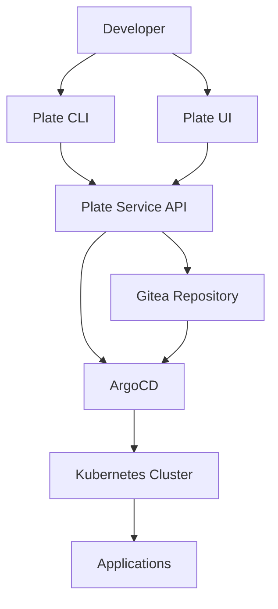
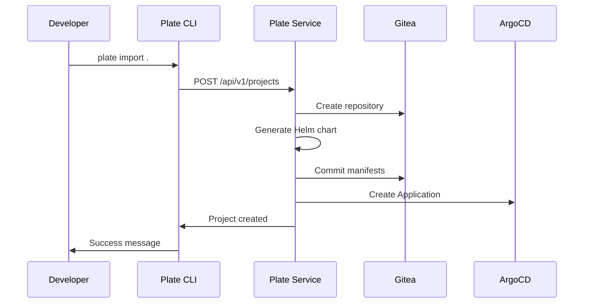
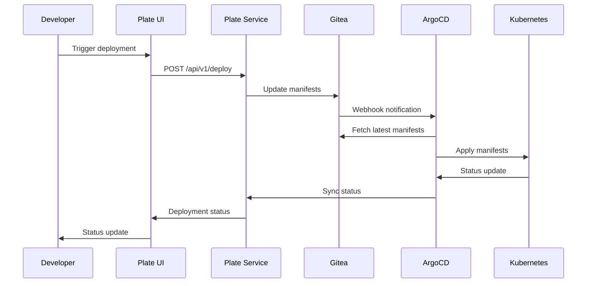

# Plate Platform Architecture

## Overview

Plate is designed as a modern, cloud-native deployment platform that leverages GitOps principles to provide reliable, scalable, and auditable deployments.

## System Architecture

### High-Level Architecture



### Component Interaction

1. **Developer Interaction**: Developers interact with the platform via CLI or Web UI
2. **API Gateway**: All requests flow through the Plate Service API
3. **GitOps Repository**: Configuration stored in Gitea repositories
4. **Deployment Engine**: ArgoCD monitors repositories and deploys changes
5. **Runtime Environment**: Applications run on Kubernetes cluster

## Core Components

### Plate CLI
- **Purpose**: Command-line interface for developers
- **Responsibilities**:
  - Project import and configuration
  - Deployment triggering
  - Status monitoring
  - Environment management

### Plate UI
- **Purpose**: Web-based dashboard
- **Responsibilities**:
  - Visual project management
  - Deployment monitoring
  - System health overview
  - Configuration management

### Plate Service
- **Purpose**: Backend API and orchestration engine
- **Responsibilities**:
  - REST API endpoints
  - YAML manifest generation
  - Git repository management
  - ArgoCD application lifecycle
  - Helm chart templating

### Infrastructure Components

#### ArgoCD
- **Role**: GitOps deployment controller
- **Responsibilities**:
  - Monitor Git repositories for changes
  - Synchronize cluster state with Git
  - Provide deployment status and health checks
  - Handle rollbacks and updates

#### Gitea
- **Role**: Git repository hosting
- **Responsibilities**:
  - Store application manifests
  - Version control for configurations
  - Webhook notifications
  - Access control and security

#### Helm
- **Role**: Kubernetes package manager
- **Responsibilities**:
  - Template generation
  - Value substitution
  - Release management
  - Dependency management

#### Kubernetes
- **Role**: Container orchestration platform
- **Responsibilities**:
  - Application deployment
  - Service discovery
  - Load balancing
  - Resource management

## Data Flow

### Project Import Flow



### Deployment Flow



## Security Architecture

### Authentication & Authorization
- **CLI**: Token-based authentication
- **UI**: Session-based authentication
- **API**: JWT tokens with role-based access control
- **Git**: SSH keys and access tokens
- **ArgoCD**: RBAC with Kubernetes service accounts

### Network Security
- **TLS/SSL**: All communications encrypted
- **Network Policies**: Kubernetes network segmentation
- **Service Mesh**: Optional Istio integration
- **Secrets Management**: Kubernetes secrets with external secret operators

## Scalability Considerations

### Horizontal Scaling
- **API Service**: Stateless, can run multiple replicas
- **UI**: Static assets served via CDN
- **Database**: PostgreSQL with read replicas
- **ArgoCD**: Sharded for large-scale deployments

### Performance Optimization
- **Caching**: Redis for API response caching
- **Database**: Connection pooling and query optimization
- **Git**: Shallow clones and incremental syncs
- **Monitoring**: Prometheus metrics and alerting

## Deployment Patterns

### Multi-Environment Strategy
```
Development → Staging → Production
     ↓            ↓         ↓
  dev-cluster  staging   prod-cluster
```

### GitOps Repository Structure
```
config-repo/
├── applications/
│   ├── web-app/
│   │   ├── dev/
│   │   ├── staging/
│   │   └── prod/
│   └── api-service/
├── environments/
│   ├── development.yaml
│   ├── staging.yaml
│   └── production.yaml
└── charts/
    ├── web-app/
    └── api-service/
```

## Monitoring & Observability

### Metrics Collection
- **Application Metrics**: Custom metrics via Prometheus
- **Infrastructure Metrics**: Node and cluster metrics
- **Deployment Metrics**: Success rates, duration, rollback frequency

### Logging Strategy
- **Centralized Logging**: ELK stack or similar
- **Structured Logs**: JSON format with correlation IDs
- **Audit Logs**: All deployment actions logged

### Health Checks
- **Application Health**: Kubernetes readiness/liveness probes
- **Service Health**: API endpoint monitoring
- **Infrastructure Health**: Cluster and node monitoring

## Disaster Recovery

### Backup Strategy
- **Git Repositories**: Distributed nature provides backup
- **Database**: Regular backups with point-in-time recovery
- **Kubernetes**: etcd backups and cluster snapshots

### Recovery Procedures
- **Application Recovery**: GitOps ensures declarative state
- **Data Recovery**: Database restoration procedures
- **Cluster Recovery**: Infrastructure as Code for cluster rebuild